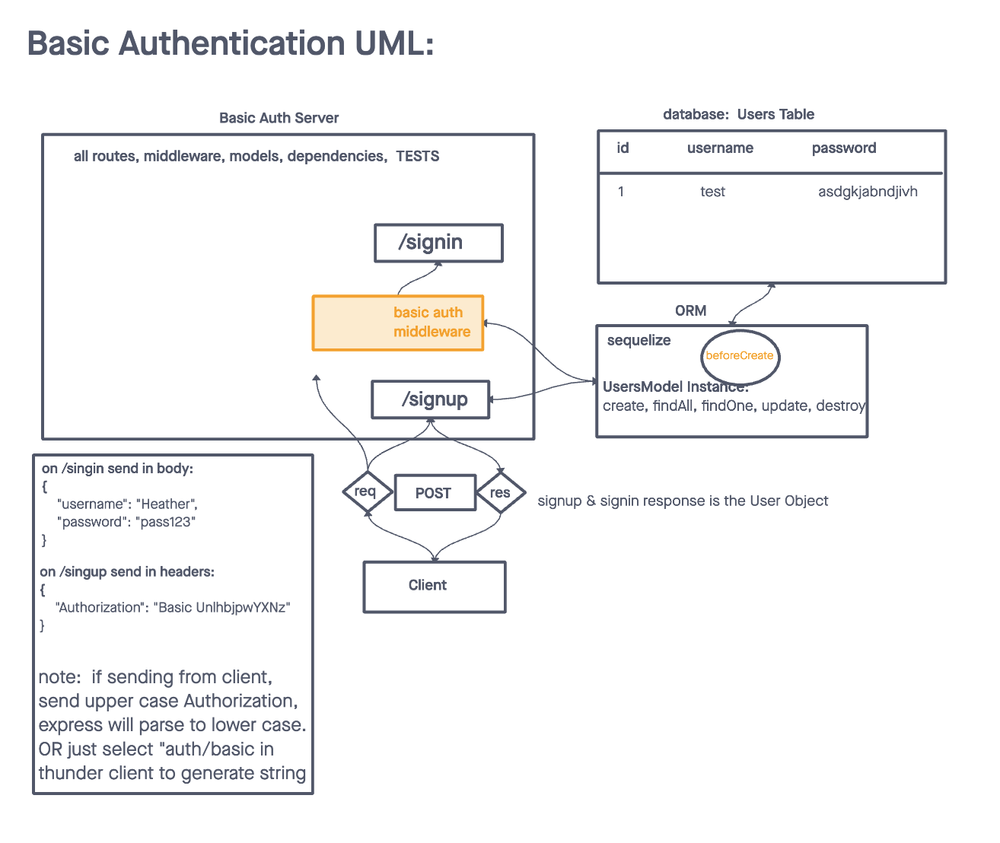

# LAB - Class 06

## Project: Basic Auth

### Author: Heather Holcomb | 401d53

### Problem Domain

An Express/Node.js based server using a custom “authentication” module that is designed to handle user registration and sign in using Basic, Bearer, or OAuth along with a custom “authorization” module that will grant/deny users access to the server based on their role or permissions level.

### Links and Resources

- [GitHub Actions ci/cd](https://github.com/holcombheather/basic-auth/actions)
- [back-end server url](https://basic-auth-sw7m.onrender.com)

### Collaborators

- Referenced class demo code taught by Ryan Gallaway

### Setup

1. Clone this repo into your local environment
2. `npm init -y`
3. `npm i cors express jest supertest sequelize sequelize-cli sqlite3 pg base-64 bcrypt eslint dotenv`

#### `.env` requirements (where applicable)

- `PORT` - 3001
- `DATABASE_URL` - see `.env.sample`

#### How to initialize/run your application (where applicable)

- `npm start` or `nodemon`

#### How to use your library (where applicable)

#### Features / Routes

Auth Module Requirements
- Users can create an account, associated with a “role”
- User Roles will be pre-defined and will each have a list of allowed capabilities
    - `admin` can read, create, update, delete
    - `editor` can read, create, update
    - `writer` can read, create
    - `user` can read
- Users can then login with a valid username and password
- Alternatively, users can login using an OAuth provider such as Google or GitHub
    - In this case, users should be automatically assigned the role of user
- Once logged in, Users can then access any route on the server, so long as they are permitted by the capabilities that match their role.
    - For example, a route that deletes records should only work if your user role is “admin”

Lab 06 Requirements
- As a user, I want to create a new account so that I may later login
  - Using an HTTP REST client or a web form:
    - Make a **POST** request to the `/signup` route with `username` and `password`.
      - Your server should support both JSON and FORM data as input.
      - On a successful account creation, return a 201 status with the user object in the body.
      - On any error, trigger your error handler with an appropriate error.
- As a user, I want to login to my account so that I may access protected information
  - Using am HTTP REST client, or a web form:
    - Make a **POST** request to the `/signin` route.
      - Send a basic authentication header with a properly encoded username and password combination.
      - On a successful account login, return a **200** status with the user object in the body.
      - On any error, trigger your error handler with the message “Invalid Login”.

#### Tests

- `npm test`
- POST to /signup to create a new user.
- POST to /signin to login as a user (use basic auth).
- Need tests for auth middleware and the routes.
    - Does the middleware function (send it a basic header).
    - Do the routes assert the requirements (signup/signin).
- This is going to require more “end to end” testing than you’ve done in the past.
    - To test signin, your tests actually need to create a user first, then try and login. i.e. The signin test will rely on the success of the signup test.

#### UML

